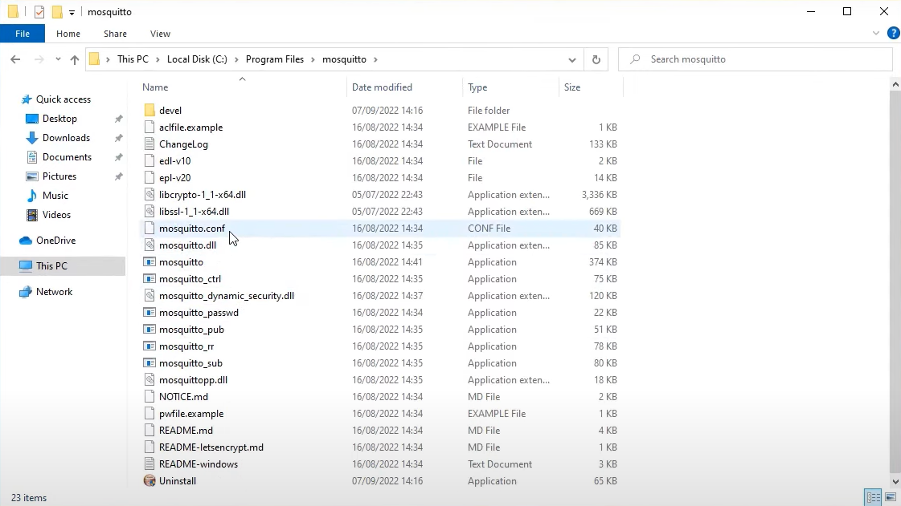

# How to install Mosquitto broker and configure it on Windows
In this project you can find an information about how to install your own local broker and configure it 
------------------------------------------
## Description

- Installing mosquitto
- Configure Firewall
- Configure mosquitto.conf
- Run mosquitto broker
- Install MQTT explorer
- Connect to your MQTT broker

## Installing mosquitto

First of all, we need to download the [mosquitto installer](https://mosquitto.org/download/)

After downloading it run the installer and follow the instructions

## Configuring Firewall

Open the Windows Defender Firewall -> Advanced settings

Go to the "Inbound Rules" and press "New Rule..."

Select "Predifined -> File and Printer Sharing"

Next, select "File and Printer Sharing (Echo Request - ICMPv4-ln)". Then press Finish

Now we need to add one more New Rule. This time we select "Port"

Next we need to enter the number of port (1883)

At the and, we need to give a name to our new rule

## Configure mosquitto.conf

Now we need to configure our mosquitto. To do this, we go to the directory of our mosquitto. Usually, it is located in C:\Program Files\mosquitto

Open the mosquitto.conf file in editor. You can use any editor you want. Now we search for #listener. We have to uncomment it and setup the number of port

Now we need to find #allow_anonimous false, uncomment it and set the value to true

## Run mosquitto broker

After all this simulations, don't forget to save the .config file. After saving it, we can run our mosquitto MQTT broker. Run PowerShell as an administration and type "net start mosquitto"

## Install MQTT explorer

Now you can use any MQTT client to test your mosquitto MQTT broker. In this case we use Mqtt explorer

