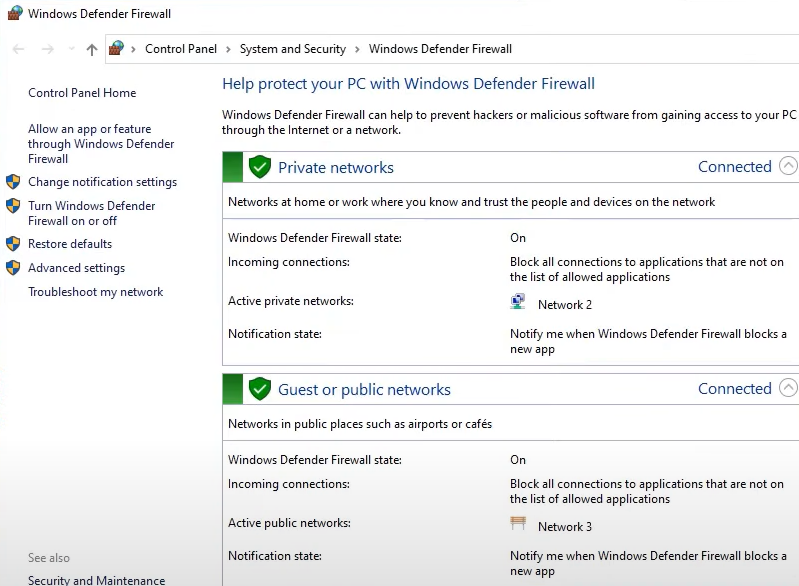

# How to install Mosquitto broker and configure it on Windows
In this project you can find an information about how to install your own local broker and configure it 
------------------------------------------
## Description

- Installing mosquitto
- Configure Firewall
- Run mosquitto broker
- Configure mosquitto.conf
- Install MQTT explorer
- connect to your MQTT broker

## Installing mosquitto

First of all, we need to download the [mosquitto installer](https://mosquitto.org/download/)

After downloading it run the installer and follow the instructions

## Configuring Firewall

Open the Windows Defender Firewall -> Advanced settings

Go to the "Inbound Rules" and press "New Rule..."

